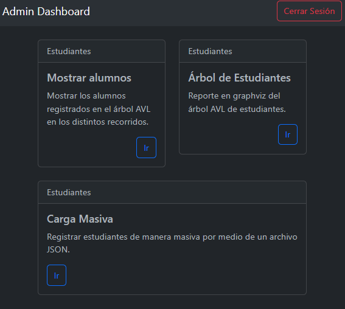
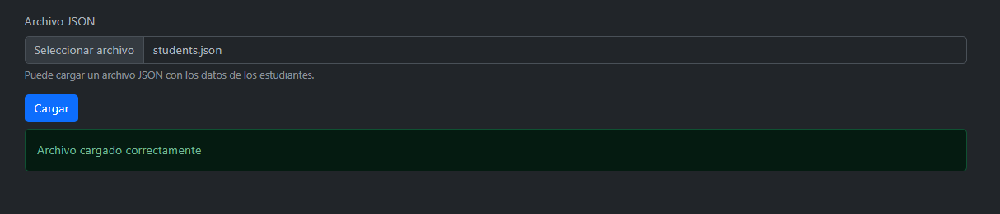
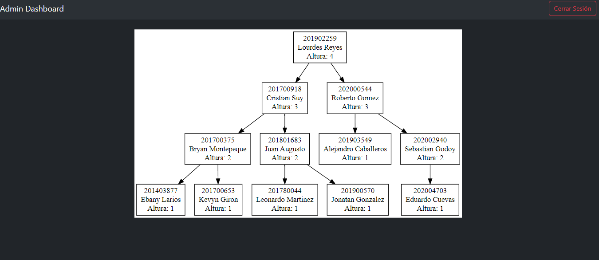
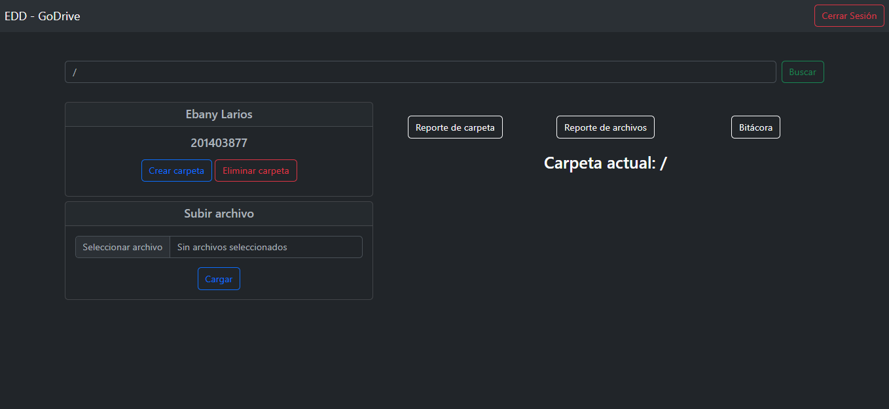
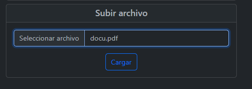
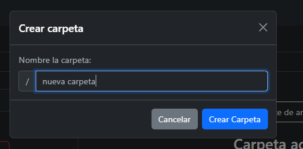
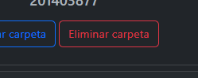
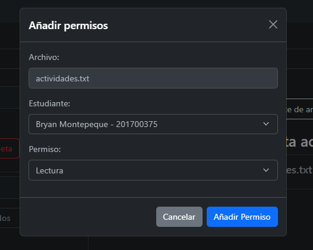
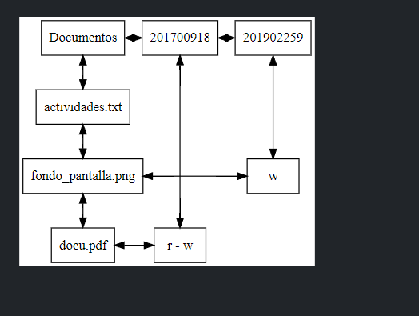
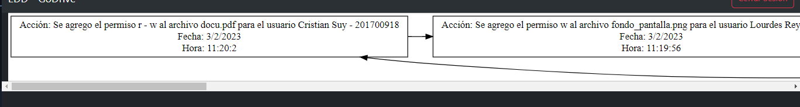

# **EDD Go Drive**
### Universidad de San Carlos de Guatemala
### Facultad de Ingeniería
### Escuela de Ciencias y Sistemas
### Estructuras de Datos
### Sección C
  

## **Manual de Usuario**
  

| Nombre | Carnet | 
| --- | --- |
| Damián Ignacio Peña Afre | 202110568 |
----

# **Descripción General**

La Facultad de Ingeniería de la Universidad de San Carlos de Guatemala requiere un sistema para almacenar archivos importantes que se ajuste a sus necesidades. Ante la falta de opciones adecuadas, se ha planteado la creación de un sistema propio llamado EDD GoDrive. La aplicación debe tener la capacidad de ser utilizada en cualquier sistema operativo, y se está considerando la opción de crearla como un sitio web utilizando Github Pages.

El objetivo del proyecto es crear un sistema similar a Google Drive, pero con la particularidad de que la Universidad de San Carlos de Guatemala será el propietario del mismo. La aplicación debe contar con características específicas que permitan el almacenamiento, creación y eliminación de carpetas y archivos, así como la modificación de nombres de archivos y carpetas ya creados. Además, se debe llevar un control de usuarios, donde cada curso de la carrera de ingeniería en sistemas tendrá un espacio de almacenamiento propio.

Como estudiante de ingeniería en sistemas, se le encomienda la tarea de desarrollar esta aplicación para la Facultad de Ingeniería. La aplicación debe ser responsiva y amigable para el usuario, de manera que sea fácil de usar y accesible desde cualquier dispositivo. En la siguiente sección, se proporcionarán detalles adicionales sobre los requisitos y funcionalidades esperados del sistema EDD GoDrive.

# **Funciones de Administrador**

La aplicación dispondrá de una página principal que permitirá a los estudiantes aceptados iniciar sesión, y al administrador acceder mediante la búsqueda en el árbol de alumnos. En el caso del administrador, no estará incluido en el árbol y solo se validará si el usuario y contraseña coinciden con "Admin".

 * Vista principal
Las funciones del administrador incluyen una vista principal que mostrará visualmente en una tabla los alumnos aprobados que se encuentran en el sistema. Además, el administrador podrá generar un informe del árbol generado por los alumnos, que estarán almacenados en un árbol AVL. Para mostrar los datos, se utilizará el recorrido In-Orden por defecto, aunque el administrador podrá elegir otro tipo de recorrido como Post-Orden o Pre-Orden.

 * Carga masiva

La carga masiva de datos será una función disponible para el administrador, que le permitirá subir un archivo de tipo JSON con los datos de los estudiantes para facilitar su gestión.

 * Generar reporte

En cuanto a los reportes, el administrador tendrá un apartado específico que le mostrará el Árbol AVL con todos los estudiantes, así como la altura que posee cada nodo de la estructura.

# **Funciones de Usuario**

 * Vista Principal
Cuando el usuario inicie sesión, se le presentará una ventana con diversas opciones para crear, eliminar o modificar carpetas. Para acceder a las carpetas del sistema, se utilizará una barra de búsqueda superior en la que el usuario podrá ingresar la ruta de su carpeta. La aplicación verificará que la ruta sea válida y existente; en caso contrario, se mostrará una alerta que indique que el directorio no es válido. Para el almacenamiento de las carpetas, se implementará un árbol indexado. Cada usuario dentro del sistema tendrá su propio árbol, y para el almacenamiento de los archivos en cada carpeta se utilizará una matriz dispersa ligada a cada nodo del árbol.

 * Subir archivo

La aplicación permitirá subir archivos con las extensiones .txt, .pdf e imágenes. Las extensiones serán restringidas para que solo se puedan subir archivos de texto, imágenes o archivos PDF. Los archivos de imágenes y archivos PDF serán codificados en base64 para su almacenamiento en la estructura. No será posible agregar archivos con el mismo nombre en la misma ruta. Si ya existe un archivo con el mismo nombre, se asignará un alias adicional. Por ejemplo, si el archivo que se intenta cargar se llama "a.txt" y ya existe otro archivo con el mismo nombre, se le asignará el nombre "[COPIA] a.txt". El alias quedará a discreción del usuario.

 * Crear carpeta

De manera similar a los archivos, el usuario podrá crear carpetas dentro del directorio actual.

 * Eliminar carpeta

El usuario podrá eliminar una carpeta, y la aplicación eliminará tanto la carpeta como todos los archivos y carpetas que contenga. La aplicación solicitará el nombre de la carpeta que se desea eliminar y buscará si existe en la carpeta actual.

 * Permiso de archivos

El usuario podrá otorgar permisos de sus archivos a otro usuario mediante una interfaz en la que se especifique el usuario, el archivo y los permisos que se le otorgarán. Los permisos se otorgarán mediante los sufijos "r" para leer y "w" para escribir. La información de los permisos se almacenará en una matriz dispersa.

 * Reporte de carpetas

 El usuario tendrá la opción de crear un reporte del árbol N-ario de archivos que tenga almacenado en su cuenta.
 
 

 * Reporte de archivos
 El usuario tendrá la opción de crear un reporte de la matriz dispersa que contenga los permisos de los archivos.

 * Reporte de bitacora

 El sistema mantendrá una bitácora que registrará todas las acciones realizadas por los usuarios no administradores. Cada vez que se cree o elimine un archivo o carpeta, se mostrará una lista enlazada circular con la información de la acción realizada en la bitácora. De esta manera, se llevará un registro de las actividades realizadas en el sistema por los usuarios no administradores.

 